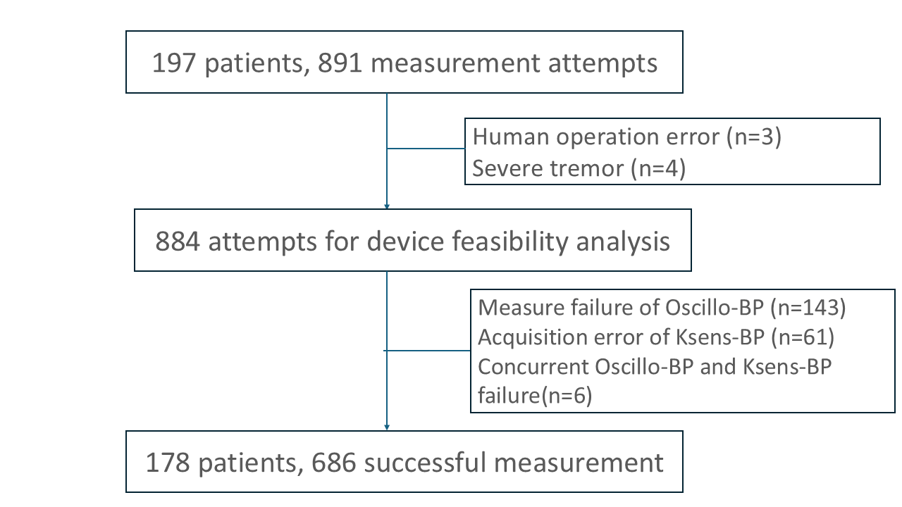
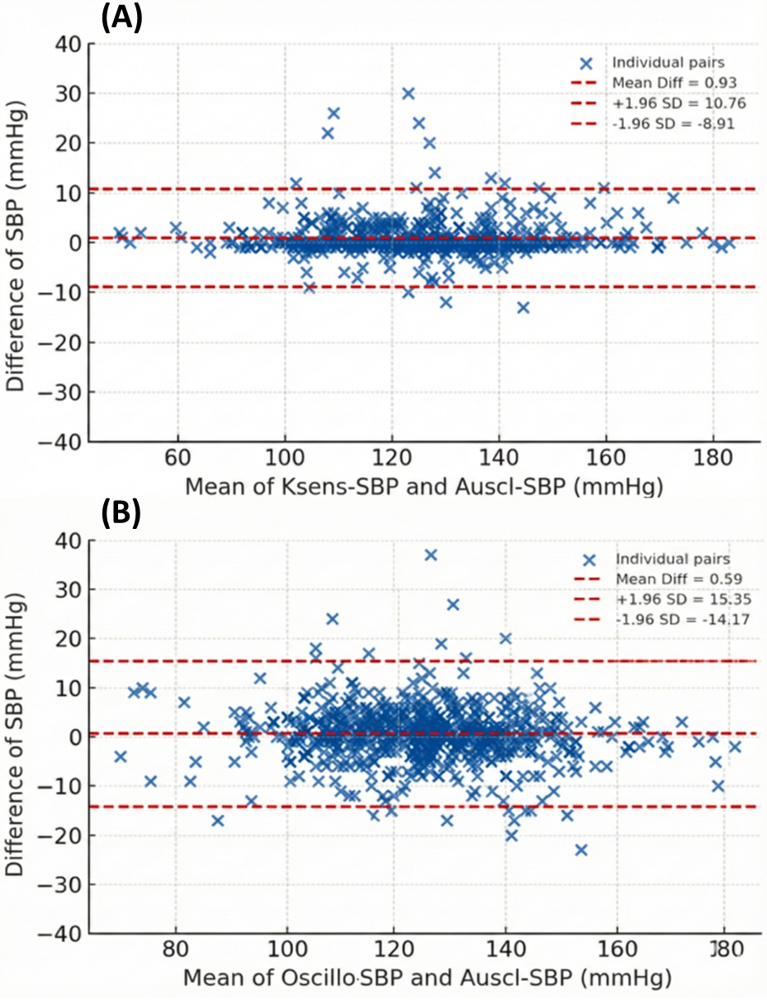
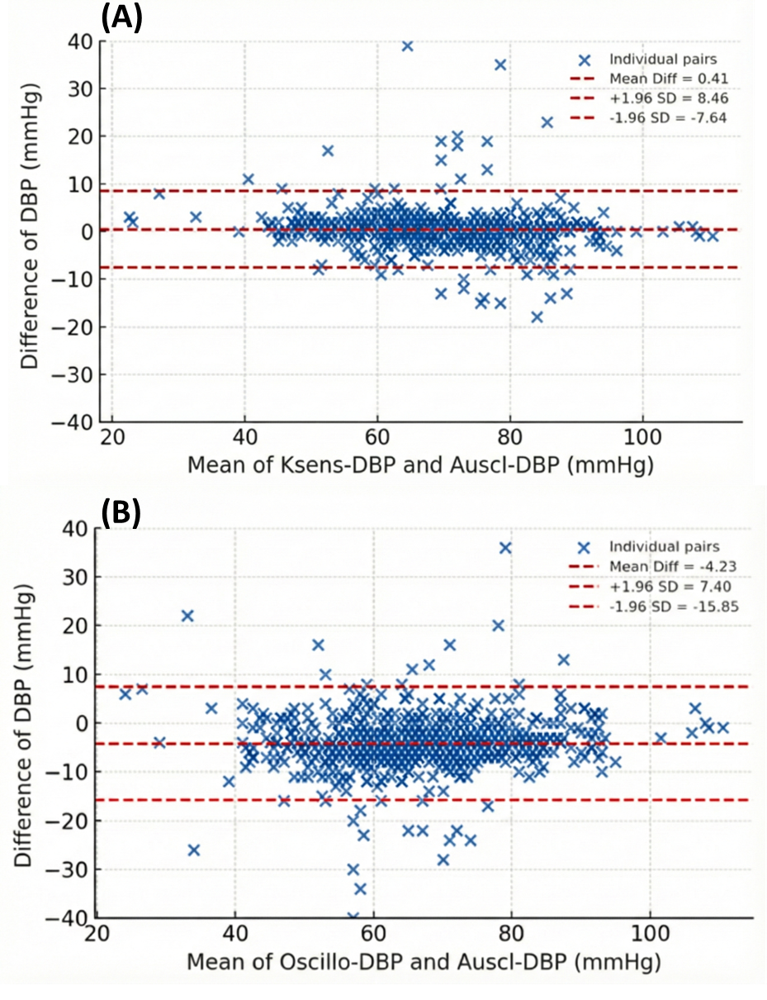

# Results

## Study Population

{fig-scap="Study flow from enrollment to the final paired analytic dataset." height=85%}

```{=latex}
\FloatBarrier
```

As shown in Figure 3.1, a total of 197 patients contributed 891 blood pressure measurement attempts during the study period. Seven attempts were excluded before device feasibility analysis because of human operation error (n = 3) or severe tremor (n = 4), leaving 884 attempts for feasibility evaluation. Among these, additional attempts were excluded due to Oscillo-BP measurement failure (n = 143), Ksens-BP acquisition error (n = 61), or concurrent failure of both devices (n = 6). The final analytic dataset therefore comprised 686 successful paired measurements from 178 patients.

```{=latex}
\FloatBarrier
\clearpage
```

Table 3.1 summarizes the baseline characteristics of the enrolled cohort. The mean age was 67.39 +/- 9.61 years, and 142 participants (79.8%) were male. The mean height, body weight, and BMI were 164.15 +/- 8.05 cm, 71.43 +/- 13.52 kg, and 26.38 +/- 3.89 kg/m2, respectively. Hypertension was the most prevalent comorbidity (129, 72.5%), followed by CAD (90, 50.6%), DM (69, 38.8%), and a history of acute MI (61, 34.3%). HF and AF were present in 27 (15.2%) and 28 (15.7%) participants, whereas stroke (7, 3.9%) and PAD (6, 3.4%) were less common.

```{r}
#| tbl-cap: "Baseline characteristics of the study population."
#| tbl-scap: "Baseline characteristics of the study population."
library(readr)
library(gt)

table1_path_candidates <- c(
  "outputs/tables/table 3-1.csv",
  "../outputs/tables/table 3-1.csv"
)
table1_path <- table1_path_candidates[file.exists(table1_path_candidates)][1]
if (is.na(table1_path)) {
  stop(
    "'table 3-1.csv' not found. Checked:\n",
    paste(table1_path_candidates, collapse = "\n")
  )
}

table1 <- read_csv(table1_path, show_col_types = FALSE, na = "NA")
table1 <- table1 |>
  dplyr::mutate(
    dplyr::across(
      where(is.character),
      ~ gsub("\\+/-", "\u00B1", .x)
    )
  )

label_mean_sd <- if (knitr::is_html_output()) {
  html("mean&nbsp;&plusmn;&nbsp;SD<br>or n(%)")
} else {
  "mean +/- SD or n(%)"
}

table1 |>
  gt() |>
  cols_align(align = "left", columns = 1) |>
  cols_align(align = "right", columns = 2) |>
  cols_label(`mean +/- SD or n(%)` = label_mean_sd) |>
  tab_style(
    style = cell_text(weight = "bold"),
    locations = cells_column_labels(everything())
  ) |>
  tab_style(
    style = cell_text(style = "italic"),
    locations = cells_body(
      columns = Variable,
      rows = Variable %in% c("Demographics", "Anthropometrics", "Comorbidities")
    )
  )
```

```{=latex}
\clearpage
```

## Agreement and Systematic Differences Between Devices

Table 3.2 demonstrates strong agreement between each index device and the auscultatory reference, with consistently higher concordance for Ksens-BP than for Oscillo-BP. For systolic blood pressure, the CCC was 0.957 (95% CI, 0.950-0.962) for K-SYS versus C-SYS and 0.903 (95% CI, 0.888-0.916) for O-SYS versus C-SYS. A similar pattern was observed for diastolic blood pressure, with CCC values of 0.946 (95% CI, 0.937-0.953) for K-DIA versus C-DIA and 0.851 (95% CI, 0.831-0.869) for O-DIA versus C-DIA.

```{r}
#| output: asis
table2_path_candidates <- c(
  "outputs/tables/table 3-2.csv",
  "outputs/tables/table3-2.csv",
  "outputs/tables/table3-2_ccc.csv",
  "../outputs/tables/table 3-2.csv",
  "../outputs/tables/table3-2.csv",
  "../outputs/tables/table3-2_ccc.csv"
)
table2_path <- table2_path_candidates[file.exists(table2_path_candidates)][1]
if (is.na(table2_path)) {
  stop(
    "'table 3-2.csv / table3-2.csv / table3-2_ccc.csv' not found. Checked:\n",
    paste(table2_path_candidates, collapse = "\n")
  )
}

table2 <- read_csv(table2_path, show_col_types = FALSE, na = "NA")
tbl_latex <- table2 |>
  gt() |>
  cols_align(align = "left", columns = 1) |>
  cols_align(align = "right", columns = 2) |>
  tab_style(
    style = cell_text(weight = "bold"),
    locations = cells_column_labels(everything())
  ) |>
  tab_style(
    style = cell_text(weight = "bold"),
    locations = cells_body(
      columns = `device comparison`,
      rows = `device comparison` %in% c("SBP", "DBP")
    )
  ) |>
  sub_missing(missing_text = "") |>
  as_latex()

tbl_str <- as.character(tbl_latex)
tbl_str <- gsub("\\\\begin\\{table\\}.*?\\n", "", tbl_str)
tbl_str <- gsub("\\\\end\\{table\\}", "", tbl_str)
tbl_str <- gsub("\\\\caption\\*\\{.*?\\}", "", tbl_str)
cat("\\vspace{5\\baselineskip}\n\\captionof{table}{Agreement metrics between devices.}\n", tbl_str, "\n")
```

```{=latex}
\FloatBarrier
```

```{r}
#| label: fig-ba-sbp
#| fig-cap: "\\textbf{Bland-Altman plots for systolic BP.} Panel (A): Oscillo-BP versus auscultatory reference. Panel (B): Ksens-BP versus auscultatory reference."
#| fig-scap: "Bland-Altman plots for systolic BP."
#| out-width: "100%"

```

```{r}
#| label: fig-ba-dbp
#| fig-cap: "\\textbf{Bland-Altman plots for diastolic BP.} Panel (A): Oscillo-BP versus auscultatory reference. Panel (B): Ksens-BP versus auscultatory reference."
#| fig-scap: "Bland-Altman plots for diastolic BP."
#| out-width: "100%"

```

```{=latex}
\FloatBarrier
```

Bland-Altman plots (Figures 3.2A, 3.2B, 3.3A, and 3.3B) were concordant with these results. For systolic pressure, Ksens-BP showed a small positive bias with narrower limits of agreement (mean difference, 0.93 mmHg; limits of agreement, -8.91 to 10.76 mmHg) compared with Oscillo-BP (mean difference, 0.59 mmHg; limits of agreement, -14.17 to 15.35 mmHg). For diastolic pressure, Ksens-BP again demonstrated tighter dispersion and minimal bias (mean difference, 0.41 mmHg; limits of agreement, -7.64 to 8.46 mmHg), whereas Oscillo-BP showed a larger negative bias and wider limits (mean difference, -4.23 mmHg; limits of agreement, -15.85 to 7.40 mmHg), indicating systematic underestimation relative to auscultatory measurements.

Consistent with the agreement analyses, Table 3.3 showed smaller absolute differences for Ksens-BP than for Oscillo-BP in both pressure domains. For systolic measurements, the mean absolute difference was 2.0 mmHg for Ksens-BP versus 4.4 mmHg for Oscillo-BP; for diastolic measurements, the corresponding values were 2.3 and 5.4 mmHg. Mean signed differences further indicated directionality of bias: Oscillo-BP was near-neutral for systolic pressure (+0.6 mmHg) but substantially underestimated diastolic pressure (-4.2 mmHg), whereas Ksens-BP remained close to zero for both systolic (+0.9 mmHg) and diastolic (+0.4 mmHg) readings. The between-device comparisons favored Ksens-BP for both systolic and diastolic performance (both p < 0.001).

```{r}
#| output: asis
table33_path_candidates <- c(
  "outputs/tables/table3-3.csv",
  "../outputs/tables/table3-3.csv"
)
table33_path <- table33_path_candidates[file.exists(table33_path_candidates)][1]
if (is.na(table33_path)) {
  stop(
    "'table3-3.csv' not found. Checked:\n",
    paste(table33_path_candidates, collapse = "\n")
  )
}
table33_raw <- read_csv(table33_path, show_col_types = FALSE, na = "NA")

# Restructure to match Table 3.2 style: SBP/DBP group headers
table33 <- tibble::tibble(
  Comparison = c("SBP", "Oscillo vs. Auscl", "Ksens vs. Auscl",
                 "DBP", "Oscillo vs. Auscl", "Ksens vs. Auscl"),
  `Mean absolute difference` = c(NA, 4.4, 2.0, NA, 5.4, 2.3),
  `Mean difference` = c(NA, 0.6, 0.9, NA, -4.2, 0.4),
  SD = c(NA, 7.5, 5.0, NA, 5.9, 4.1),
  `P value` = c(NA, NA, "< 0.001", NA, NA, "< 0.001")
)

label_abs <- if (knitr::is_html_output()) {
  html("Mean absolute<br>difference")
} else {
  "Mean absolute\ndifference"
}
label_mean <- if (knitr::is_html_output()) {
  html("Mean<br>difference")
} else {
  "Mean\ndifference"
}

tbl_gt <- table33 |>
  gt() |>
  cols_label(
    `Mean absolute difference` = label_abs,
    `Mean difference` = label_mean
  ) |>
  cols_align(align = "left", columns = 1) |>
  cols_align(align = "right", columns = 2:5) |>
  tab_style(
    style = cell_text(weight = "bold"),
    locations = cells_column_labels(everything())
  ) |>
  tab_style(
    style = cell_text(weight = "bold"),
    locations = cells_body(
      columns = Comparison,
      rows = Comparison %in% c("SBP", "DBP")
    )
  ) |>
  sub_missing(missing_text = "")

tbl_str <- as.character(as_latex(tbl_gt))
tbl_str <- gsub("\\\\begin\\{table\\}.*?\\n", "", tbl_str)
tbl_str <- gsub("\\\\end\\{table\\}", "", tbl_str)
tbl_str <- gsub("\\\\caption\\*\\{.*?\\}", "", tbl_str)
cat("\\vspace{2\\baselineskip}\n\\captionof{table}{Systematic differences and absolute differences.}\n", tbl_str, "\n")
```

```{=latex}
\clearpage
```

## Factors Influencing Measurement Differences

Tables 3.4 and 3.5 summarize mixed-effects models evaluating clinical factors associated with measurement differences versus the auscultatory reference. For systolic differences (Table 3.4), male sex was independently associated with larger Oscillo-SBP differences (beta = 2.92 mmHg, 95% CI 1.00 to 4.84; p = 0.003), whereas no corresponding association was observed for Ksens-SBP (beta = -0.03 mmHg, 95% CI -1.03 to 0.98; p = 0.959). No other covariates reached statistical significance for systolic differences in either device model, although DM showed a borderline inverse association in the Ksens-SBP model (beta = -0.75 mmHg, 95% CI -1.56 to 0.06; p = 0.070).

For diastolic differences (Table 3.5), none of the prespecified covariates were statistically significant at the 0.05 level in either device model. In the Ksens-DBP model, higher heart rate (HR) showed a borderline negative association with measurement differences (beta = -0.03 mmHg per bpm, 95% CI -0.06 to 0.00; p = 0.052). In the Oscillo-DBP model, AF tended to be associated with larger positive differences (beta = 2.26 mmHg, 95% CI -0.17 to 4.69; p = 0.069), but this did not reach conventional significance. Overall, these findings suggest limited and outcome-specific covariate effects, with the most robust signal observed for sex-related variation in Oscillo-based systolic measurements.

```{=latex}
\newpage
\begin{minipage}{\linewidth}
```

```{r}
#| results: asis
table34_path_candidates <- c(
  "outputs/tables/table3-4_sbp_mixedmodel.csv",
  "../outputs/tables/table3-4_sbp_mixedmodel.csv"
)
table34_path <- table34_path_candidates[file.exists(table34_path_candidates)][1]
if (is.na(table34_path)) {
  stop(
    "'table3-4_sbp_mixedmodel.csv' not found. Checked:\n",
    paste(table34_path_candidates, collapse = "\n")
  )
}
table34 <- read_csv(table34_path, show_col_types = FALSE, na = "NA")
names(table34)[3] <- "p_oscillo"
names(table34)[5] <- "p_ksens"
table34_gt <- table34 |>
  gt() |>
  cols_label(
    p_oscillo = "p",
    p_ksens = "p"
  ) |>
  tab_style(
    style = cell_text(weight = "bold"),
    locations = cells_column_labels(everything())
  ) |>
  tab_options(
    table.font.size = px(9),
    column_labels.font.size = px(9),
    column_labels.padding = px(1),
    data_row.padding = px(0)
  )

emit_gt_captionof <- function(gt_tbl, caption, after = "") {
  tbl_str <- as.character(as_latex(gt_tbl))
  tbl_str <- gsub("\\\\begin\\{table\\}.*?\\n", "", tbl_str)
  tbl_str <- gsub("\\\\end\\{table\\}", "", tbl_str)
  tbl_str <- gsub("\\\\caption\\*\\{.*?\\}", "", tbl_str)
  tbl_str <- gsub(
    "\\\\fontsize\\{[0-9.]+pt\\}\\{[0-9.]+pt\\}\\\\selectfont",
    "\\\\fontsize{12pt}{14pt}\\\\selectfont",
    tbl_str
  )
  cat(
    "\\captionsetup{type=table,skip=2pt}\n",
    "\\captionof{table}{", caption, "}\n",
    tbl_str,
    "\n",
    after,
    sep = ""
  )
}

if (knitr::is_latex_output()) {
  emit_gt_captionof(
    table34_gt,
    "Mixed-effects model for systolic BP difference.",
    "\\vspace{7\\baselineskip}\n"
  )
} else {
  table34_gt
}
```

```{r}
#| results: asis
table35_path_candidates <- c(
  "outputs/tables/table3-5_dbp_mixedmodel.csv",
  "../outputs/tables/table3-5_dbp_mixedmodel.csv"
)
table35_path <- table35_path_candidates[file.exists(table35_path_candidates)][1]
if (is.na(table35_path)) {
  stop(
    "'table3-5_dbp_mixedmodel.csv' not found. Checked:\n",
    paste(table35_path_candidates, collapse = "\n")
  )
}
table35 <- read_csv(table35_path, show_col_types = FALSE, na = "NA")
names(table35)[3] <- "p_oscillo"
names(table35)[5] <- "p_ksens"
table35_gt <- table35 |>
  gt() |>
  cols_label(
    p_oscillo = "p",
    p_ksens = "p"
  ) |>
  tab_style(
    style = cell_text(weight = "bold"),
    locations = cells_column_labels(everything())
  ) |>
  tab_options(
    table.font.size = px(9),
    column_labels.font.size = px(9),
    column_labels.padding = px(1),
    data_row.padding = px(0)
  )

if (knitr::is_latex_output()) {
  emit_gt_captionof(
    table35_gt,
    "Mixed-effects model for diastolic BP difference."
  )
} else {
  table35_gt
}
```

```{=latex}
\end{minipage}
```

```{=latex}
\clearpage
```

## Subgroup Analyses

```{=latex}
\enlargethispage{2\baselineskip}
\begin{figure}[H]
\centering
\makebox[\textwidth][c]{\includegraphics[height=0.40\textheight]{outputs/figures/3-4forest_SYS_absdiff_subgroups.png}}
\captionsetup{font=footnotesize}
\caption[Forest plot of subgroup analyses for systolic absolute differences.]{\textbf{Forest plot of subgroup analyses for systolic absolute differences.} Subgroup-specific estimates of mean absolute systolic BP differences between Ksens-BP and Oscillo-BP versus the auscultatory reference.}
\end{figure}
\vspace{-\baselineskip}
\begin{figure}[H]
\centering
\makebox[\textwidth][c]{\includegraphics[height=0.40\textheight]{outputs/figures/3-5forest_DIA_absdiff_subgroups.png}}
\captionsetup{font=footnotesize}
\caption[Forest plot of subgroup analyses for diastolic absolute differences.]{\textbf{Forest plot of subgroup analyses for diastolic absolute differences.} Subgroup-specific estimates of mean absolute diastolic BP differences between Ksens-BP and Oscillo-BP versus the auscultatory reference.}
\end{figure}
```

Figures 3.4 and 3.5 summarize subgroup analyses of comparative device performance across hypertension, DM, other ASCVD, PAD, AF, and HR strata. For systolic absolute error (Figure 3.4), the subgroup-specific estimates were consistently below zero, indicating that Ksens-BP maintained smaller absolute systolic deviation from the auscultatory reference than Oscillo-BP across all prespecified subgroups. No significant between-level contrasts were observed for systolic outcomes (all p > 0.05), suggesting no strong effect modification.

For diastolic absolute error (Figure 3.5), the overall pattern also favored Ksens-BP, but heterogeneity was evident in selected subgroups. Significant subgroup differences were observed for DM (Yes vs No: beta = -1.52 mmHg, 95% CI -2.76 to -0.28; p = 0.016) and PAD (Yes vs No: beta = 5.07 mmHg, 95% CI 1.59 to 8.55; p = 0.005), whereas contrasts by hypertension, other ASCVD, and AF were not significant. Although the formal HR tertile analysis did not reach statistical significance, a directional trend toward larger diastolic differences at higher HR was visually apparent in the forest plot. A post-hoc binary analysis using a clinically relevant threshold (HR < 100 vs ≥ 100 bpm) confirmed a significant interaction (mean difference 5.48 [95% CI, 3.59–7.37] vs 8.43 [95% CI, 5.36–11.50] mmHg; p for interaction = 0.022), suggesting that the diastolic accuracy advantage of Ksens-BP over Oscillo-BP was amplified in patients with elevated HR. These findings indicate that the comparative diastolic advantage of Ksens-BP was generally robust but varied in magnitude according to specific comorbidity and hemodynamic profiles.

```{=latex}
\clearpage
```

## Omron Error Analysis

Table 3.6 summarizes the attempt-level risk profile for Omron measurement error. Compared with non-error observations, error attempts were associated with older age, smaller arm circumference, lower BMI, and higher HR, with the largest standardized imbalance observed for AF. AF was substantially more frequent in error attempts (39.9% vs 12.8%; SMD = 0.65). PAD was also more prevalent among error attempts, whereas DM and composite ASCVD were less frequent in the error group.

```{r}
#| tbl-cap: "Omron error descriptive summary (attempt-level)."
#| tbl-scap: "Omron error descriptive summary (attempt-level)."
table36_path_candidates <- c(
  "outputs/tables/table3-6omron_error_descripitive_attempt.csv",
  "../outputs/tables/table3-6omron_error_descripitive_attempt.csv"
)
table36_path <- table36_path_candidates[file.exists(table36_path_candidates)][1]
if (is.na(table36_path)) {
  stop(
    "'table3-6omron_error_descripitive_attempt.csv' not found. Checked:\n",
    paste(table36_path_candidates, collapse = "\n")
  )
}
table36 <- read_csv(table36_path, show_col_types = FALSE, na = "NA")
label_diff36 <- if (knitr::is_html_output()) {
  html("Difference<br>[95% CI]")
} else {
  "Difference\n[95% CI]"
}

table36 |>
  gt() |>
  cols_label(
    `Difference (Error - No) [95% CI]` = label_diff36
  ) |>
  tab_style(
    style = cell_text(weight = "bold"),
    locations = cells_column_labels(everything())
  ) |>
  tab_source_note("SMD, standardized mean difference.") |>
  tab_options(table.font.size = px(11), table.width = pct(100))
```

Multivariable mixed-effects regression in Table 3.7 identified AF as the most robust independent correlate of Omron error. AF was associated with markedly increased odds of error (odds ratio [OR], 13.35; 95% CI, 3.00-59.45; p < 0.001), while age, HR, arm circumference, sex, and PAD were not statistically significant after adjustment.

```{=latex}
\clearpage
```

```{r}
#| tbl-cap: "Mixed-effects logistic regression for Omron error (attempt-level)."
#| tbl-scap: "Mixed-effects logistic regression for Omron error (attempt-level)."
table38_path_candidates <- c(
  "outputs/tables/table3-8omron_error_logistic_attempt.csv",
  "../outputs/tables/table3-8omron_error_logistic_attempt.csv"
)
table38_path <- table38_path_candidates[file.exists(table38_path_candidates)][1]
if (is.na(table38_path)) {
  stop(
    "'table3-8omron_error_logistic_attempt.csv' not found. Checked:\n",
    paste(table38_path_candidates, collapse = "\n")
  )
}
table38 <- read_csv(table38_path, show_col_types = FALSE, na = "NA")
table38 |>
  gt() |>
  tab_style(
    style = cell_text(weight = "bold"),
    locations = cells_column_labels(everything())
  )
```
